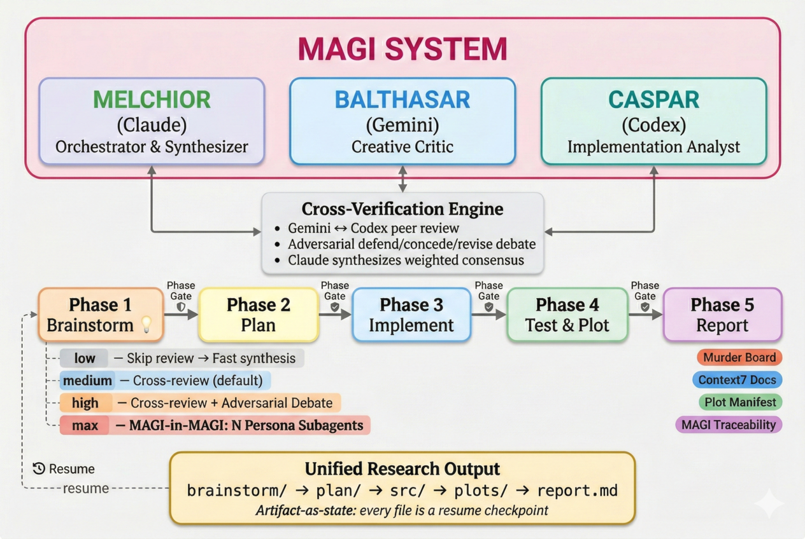

<p align="center">
  
</p>

<h1 align="center">MAGI Researchers</h1>

<p align="center">
  <strong>Three AI models. One synthesis. Zero lost progress.</strong><br/>
  <em>Multi-model research pipeline for Claude Code — Claude, Gemini, and Codex debate, cross-verify, and synthesize publication-ready artifacts.</em>
</p>

<p align="center">
  <a href="https://github.com/Axect/magi-researchers/stargazers"></a>&nbsp;
  &nbsp;
  &nbsp;
  &nbsp;
  <a href="https://github.com/Axect/magi-researchers/issues"></a>
</p>

<p align="center">
  <a href="#get-started">Get Started</a> &bull;
  <a href="#why-magi">Why MAGI?</a> &bull;
  <a href="#case-study-damped-oscillator-equation-discovery">Case Study</a> &bull;
  <a href="#features">Features</a> &bull;
  <a href="#usage">Usage</a> &bull;
  <a href="#roadmap">Roadmap</a> &bull;
  <a href="CHANGELOG.md">Changelog</a>
</p>

---

> *Like the MAGI system in Evangelion — three supercomputers cross-verifying each other — this plugin orchestrates Claude, Gemini, and Codex for rigorous, multi-perspective research.*

## Get Started

**Prerequisites:** [Claude Code](https://docs.anthropic.com/en/docs/claude-code) + Python 3.11+ with [uv](https://docs.astral.sh/uv/) + [Gemini CLI](https://github.com/google-gemini/gemini-cli) + [Codex CLI](https://github.com/openai/codex)

**1. Install the plugin** (inside Claude Code):
```
/plugin marketplace add Axect/magi-researchers
/plugin install magi-researchers@magi-researchers-marketplace
```

**2. Set up MCP servers** (one-time):
```bash
claude mcp add -s user gemini-cli -- npx -y gemini-mcp-tool
claude mcp add -s user codex-cli -- npx -y @cexll/codex-mcp-server
claude mcp add -s user context7 -- npx -y @upstash/context7-mcp@latest
```

**3. Run your first research:**
```
/magi-researchers:research "your research topic" --domain physics
```

MAGI generates cross-verified hypotheses, writes implementation code, renders publication-quality plots, and synthesizes a structured report — all saved to `outputs/{topic}/`.

<details>
<summary><strong>Alternative: Local Development</strong></summary>

```bash
git clone https://github.com/Axect/magi-researchers.git
claude --plugin-dir /path/to/magi-researchers
uv add matplotlib SciencePlots numpy
```
</details>

## Why MAGI?

Single-model research has blind spots. One model hallucinates a citation or misses a critical constraint — and nobody catches it.

| | **Single Model** | **MAGI (3 Models)** |
|:---|:---|:---|
| **Brainstorming** | One perspective | Three independent perspectives |
| **Verification** | Self-review (unreliable) | Cross-model peer review |
| **Blind spots** | Undetected | Caught by competing models |
| **Output** | Raw text | Structured report with consensus & divergence analysis |

- **Claude** — *The Scientist.* Synthesis, planning, implementation, report generation.
- **Gemini** — *The Critic.* Creative brainstorming, cross-verification, broad knowledge.
- **Codex** — *The Builder.* Feasibility analysis, code review, implementation focus.

### Case Study: Damped Oscillator Equation Discovery

We gave all three single models and MAGI the same physics problem: *discover an unknown damping function from noisy sensor data*. No single model proposed combining classical diagnostics with modern ML — only MAGI's cross-verification caught that gap.

| Source | Score | Highlight |
|:-------|------:|:----------|
| **MAGI** | **90** | Staged pipeline: rapid diagnostics → symbolic discovery → validation → fallback |
| Claude | 84 | Best code coverage — runnable snippets for every approach |
| Codex | 80 | Elegant physics-informed neural ODE constraints |
| Gemini | 67 | Most accessible for general audience |

<details>
<summary><strong>Experiment details</strong></summary>

- **Task:** Discover $f(\dot{x})$ in $m\ddot{x} + f(\dot{x}) + kx = 0$ from noisy displacement data
- **Setup:** Identical prompt → 4 sources → anonymized blind evaluation via MAGI
- **Evaluation:** Two MAGI evaluator personas scored, cross-reviewed, and debated before synthesis
- **Limitations:** N=1 case study, self-evaluation (MAGI evaluated MAGI), ~7:1 compute ratio
- **Full report:** [`examples/damped_oscillator_comparison/evaluation_report.md`](examples/damped_oscillator_comparison/evaluation_report.md)
- **Raw outputs:** [`examples/damped_oscillator_comparison/`](examples/damped_oscillator_comparison/)

</details>

## Features

### Research Pipeline

| Phase | What Happens | Output |
|:---|:---|:---|
| **1. Brainstorm** | Three models generate and cross-review ideas with expert personas | `brainstorm/` |
| **2. Plan** | Concrete research plan, stress-tested by a hostile reviewer | `plan/` |
| **3. Implement** | Claude writes code with live library doc lookups | `src/` |
| **4. Test & Visualize** | Collaborative test design + publication-quality plots | `tests/` + `plots/` |
| **5. Report** | Structured report with cross-verified claim-evidence integrity | `report.md` |

### MAGI-in-MAGI (v0.5.0)

Two models aren't enough for deep, multi-faceted research questions. `--depth max` scales to N independent domain specialists:

- **Hierarchical pipeline** — N persona subagents each run a full mini-MAGI brainstorm (Gemini + Codex + cross-review) in parallel, then a meta-layer synthesizes across all perspectives
- **Adversarial meta-debate** — Gemini and Codex meta-review all N conclusions, Claude extracts the top 3 cross-persona disagreements, and a defend/concede/revise debate resolves them
- **Enriched synthesis** — Final output includes cross-persona consensus, unique contributions, debate resolutions, emergent insights, and full MAGI process traceability
- **`--personas N`** — Scale from 2 to 5 domain specialists (default: 3) covering theory, computation, empirics, application, and critique

### Never Lose Your Work (v0.4.0)

Long research sessions crash. Context windows expire. Networks drop. Now you can pick up right where you left off:

- **`--resume`** — Interrupted mid-pipeline? Just pass `--resume <output_dir>` and MAGI detects your progress from existing files. No manual bookkeeping, no fragile state files — your artifacts *are* the checkpoints.
- **Artifact contracts** — Before each phase, MAGI verifies that all required upstream files actually exist and aren't empty. Catches silent failures before they cascade into garbage outputs.
- **Standalone phase gates** — Every sub-skill (`/research-implement`, `/research-test`) now generates its own quality gate, even when run independently outside the main pipeline.

### Stress-Tested by Design (v0.3.0)

- **Weighted direction scoring** — Rank research ideas by novelty, feasibility, impact, rigor, and scalability with domain-tuned or custom weights
- **Dynamic persona casting** — Each model gets a topic-specific expert identity (e.g., *"Bayesian statistician with causal inference expertise"*), sharpening ideation
- **Adversarial debate** — At `--depth high`, models defend, concede, or revise on their top disagreements before synthesis
- **Murder board** — Gemini attacks the research plan as a hostile reviewer; Claude documents mitigations for every flaw found
- **Phase gates** — Automated quality checkpoints with conditional MAGI mini-review before each user approval step
- **Depth control** — `--depth low` for fast/cheap runs, `medium` (default) for standard review, `high` for full adversarial analysis

### Core Capabilities

- **Publication-quality plots** — `matplotlib` + `scienceplots` (Nature theme), PNG 300 dpi + vector PDF
- **MAGI traceability review** — All three models cross-verify the final report for orphaned claims and figures
- **Report gap detection** — Auto-generates missing visualizations from existing data
- **Domain templates** — Built-in context for Physics, AI/ML, Statistics, Mathematics, and Paper Writing
- **Journal strategy** — Venue recommendations for [Physics](docs/journal-strategies.md#particle-physics-phenomenology), [AI/ML](docs/journal-strategies.md#aiml-conferences--journals), and [Interdisciplinary](docs/journal-strategies.md#interdisciplinary-science-ml--natural-sciences) research
- **LaTeX math** — Proper inline and display equations across all outputs

<details>
<summary><strong>Under the hood</strong></summary>

- **Plot manifest** — Structured `plot_manifest.json` with metadata, section hints, and captions for automated report integration
- **Gemini fallback chain** — Resilient 3-tier model fallback: `gemini-3.1-pro-preview` → `gemini-3-pro-preview` → `gemini-2.5-pro`
- **Cross-phase artifact contracts** — Each phase validates incoming artifacts before running (tool-based Glob/Read, not LLM guesswork)
- **Depth-controlled token budget** — `--depth low` skips cross-review for fast/cheap runs; `--depth high` enables full adversarial debate
- **`@filepath` artifact references** — MCP tool calls use `@filepath` syntax instead of inline content, so large artifacts are read directly from disk with zero truncation

</details>

## Usage

| Command | Description |
|:---|:---|
| `/magi-researchers:research "topic"` | Full pipeline (all 5 phases) |
| `/magi-researchers:research-brainstorm "topic"` | Brainstorming with cross-verification |
| `/magi-researchers:research-implement` | Implementation (needs existing plan) |
| `/magi-researchers:research-test` | Testing & visualization |
| `/magi-researchers:research-report` | Report generation |

### Flags

| Flag | Values | Default | Description |
|:---|:---|:---|:---|
| `--domain` | `physics` `ai_ml` `statistics` `mathematics` `paper` | auto-inferred | Research domain for context and weight defaults |
| `--weights` | JSON object | domain default | Custom scoring weights (keys: `novelty`, `feasibility`, `impact`, `rigor`, `scalability`) |
| `--depth` | `low` `medium` `high` `max` | `medium` | Review thoroughness — `max` enables hierarchical MAGI-in-MAGI pipeline |
| `--personas` | `2`–`5` | `3` | Number of domain-specialist subagents for `--depth max` |
| `--resume` | `<output_dir>` | — | Resume an interrupted pipeline from the last completed phase |

```bash
# Quick brainstorm with default settings
/magi-researchers:research "neural ODE solvers for stiff systems" --domain physics

# Deep analysis with custom weights and adversarial debate
/magi-researchers:research "causal inference in observational studies" --domain statistics --depth high --weights '{"novelty":0.2,"rigor":0.4,"feasibility":0.2,"impact":0.15,"scalability":0.05}'

# Resume a crashed session — MAGI picks up where you left off
/magi-researchers:research "neural ODE solvers" --resume outputs/neural_ode_solvers_20260225_v1

# Hierarchical multi-persona analysis (MAGI-in-MAGI)
/magi-researchers:research "variational inference for Bayesian deep learning" --domain ai_ml --depth max --personas 4

# Fast ideation only (no cross-review, lowest cost)
/magi-researchers:research-brainstorm "transformer alternatives for long sequences" --domain ai_ml --depth low
```

> If MAGI saves you research time, consider leaving a [star](https://github.com/Axect/magi-researchers/stargazers) so other researchers can find it.

### Output Structure

```
outputs/{topic_YYYYMMDD_vN}/
├── brainstorm/       # Personas, ideas, cross-reviews, debate, synthesis
├── plan/             # Research plan, murder board, mitigations, phase gate
├── src/              # Implementation + phase gate
├── tests/            # Test suite + phase gate
├── plots/            # PNG + PDF + plot_manifest.json
└── report.md         # Final structured report
```

Each phase produces artifacts that double as resume checkpoints — just pass `--resume` to continue from where you left off.

<details>
<summary><strong>Full artifact tree</strong></summary>

```
brainstorm/
├── weights.json              # Scoring weights
├── personas.md               # Expert personas
├── gemini_ideas.md           # Gemini brainstorm
├── codex_ideas.md            # Codex brainstorm
├── gemini_review_of_codex.md # Cross-review (depth ≥ medium)
├── codex_review_of_gemini.md # Cross-review (depth ≥ medium)
├── disagreements.md          # Disagreement summary (depth = high)
├── debate_round2_gemini.md   # Adversarial debate (depth = high)
├── debate_round2_codex.md    # Adversarial debate (depth = high)
└── synthesis.md              # Weighted synthesis

plan/
├── research_plan.md          # Research plan
├── murder_board.md           # Plan stress-test
├── mitigations.md            # Flaw mitigations
└── phase_gate.md             # Plan quality gate

src/
├── *.py                      # Research implementation
└── phase_gate.md             # Implementation quality gate

tests/
├── test_*.py                 # Test suite
└── phase_gate.md             # Test quality gate
```

</details>

<details>
<summary><strong>Full artifact tree — <code>--depth max</code></strong></summary>

```
brainstorm/
├── weights.json              # Scoring weights
├── personas.md               # N domain-specialist personas
├── persona_1/                # Persona 1 mini-MAGI output
│   ├── gemini_ideas.md
│   ├── codex_ideas.md
│   ├── gemini_review_of_codex.md
│   ├── codex_review_of_gemini.md
│   └── conclusion.md
├── persona_2/
│   └── ...                   # (same 5 files per persona)
├── persona_N/
│   └── ...
├── meta_review_gemini.md     # Gemini meta-review of all conclusions
├── meta_review_codex.md      # Codex meta-review of all conclusions
├── meta_disagreements.md     # Meta-disagreement summary
├── meta_debate_gemini.md     # Adversarial debate — Gemini
├── meta_debate_codex.md      # Adversarial debate — Codex
└── synthesis.md              # Enriched final synthesis
```

</details>

<details>
<summary><strong>Recommended Permissions</strong></summary>

Add to `.claude/settings.local.json`:

```json
{
  "permissions": {
    "allow": [
      "Bash(uv:*)",
      "Bash(uv run:*)",
      "Bash(uv run python3:*)",
      "Bash(uv add:*)",
      "Bash(uv sync:*)",
      "Bash(mkdir:*)",
      "mcp__gemini-cli__ask-gemini",
      "mcp__gemini-cli__brainstorm",
      "mcp__codex-cli__ask-codex",
      "mcp__codex-cli__brainstorm",
      "mcp__plugin_context7_context7__resolve-library-id",
      "mcp__plugin_context7_context7__query-docs"
    ]
  }
}
```

</details>

## Roadmap

**Shipped:**&ensp; Multi-model brainstorming & cross-verification &bull; Domain & journal strategy templates &bull; Plot manifest & gap detection &bull; MAGI traceability review &bull; LaTeX math & Gemini fallback chain &bull; Weighted scoring & dynamic personas &bull; Adversarial debate &bull; Murder board & phase gates &bull; Depth-controlled token budget &bull; Session resume (`--resume`) &bull; Artifact contract validation &bull; Standalone phase gates for all sub-skills &bull; MAGI-in-MAGI hierarchical brainstorming &bull; `@filepath` artifact references for zero-truncation MCP calls

**Up next:**
- [x] Example artifact gallery — real research outputs to showcase the pipeline
- [ ] Terminal demo GIF — one-command walkthrough
- [ ] More domain & journal strategy templates
- [ ] Ubiquitous Context7 — live doc lookups during testing and report writing, not just implementation
- [ ] Conditional variance enforcement — smart error-bar policy that catches missing uncertainty without blocking exploratory runs
- [ ] Cost estimation — token budget preview before execution

## Contributing

Contributions welcome — especially new domain templates. See [CONTRIBUTING.md](CONTRIBUTING.md).

## License

[MIT](LICENSE)
