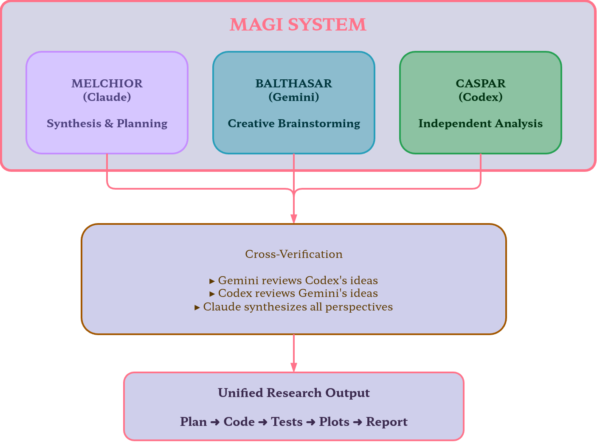

<p align="center">
  
</p>

<h1 align="center">MAGI Researchers</h1>

<p align="center">
  <strong>Three AI models. One synthesis.</strong><br/>
  <em>Multi-model research pipeline for Claude Code — orchestrating Claude, Gemini, and Codex</em>
</p>

<p align="center">
  <a href="https://github.com/Axect/magi-researchers/stargazers"></a>&nbsp;
  &nbsp;
  &nbsp;
  &nbsp;
  &nbsp;
  <a href="https://github.com/Axect/magi-researchers/issues"></a>
</p>

<p align="center">
  <a href="#quick-start">Quick Start</a> &bull;
  <a href="#why-magi">Why MAGI?</a> &bull;
  <a href="#features">Features</a> &bull;
  <a href="#journal--venue-strategy">Journal Strategy</a> &bull;
  <a href="#installation">Installation</a> &bull;
  <a href="#usage">Usage</a> &bull;
  <a href="#roadmap">Roadmap</a>
</p>

---

> *Like the MAGI system in Evangelion — three supercomputers (MELCHIOR, BALTHASAR, CASPER) cross-verifying each other to reach a unified decision — this plugin orchestrates Claude, Gemini, and Codex to conduct rigorous, multi-perspective research.*

## Quick Start

**1. Install the plugin** (inside Claude Code):
```
/plugin marketplace add Axect/magi-researchers
/plugin install magi-researchers@magi-researchers-marketplace
```

**2. Set up MCP servers** (one-time):
```bash
claude mcp add -s user gemini-cli -- npx -y gemini-mcp-tool
claude mcp add -s user codex-cli -- npx -y @cexll/codex-mcp-server
claude mcp add -s user context7 -- npx -y @upstash/context7-mcp@latest
```

**3. Run your first research:**
```
/magi-researchers:research "your research topic" --domain physics
```

You'll get: cross-verified hypotheses, a research plan, implementation code, publication-quality plots, and a structured report — all in one pipeline.

## Why MAGI?

Single-model research has blind spots. One model hallucinates a citation, invents a non-existent theorem, or misses a critical constraint — and nobody catches it.

**MAGI fixes this with cross-verification by design:**

| | Single Model | MAGI (3 Models) |
|:---|:---|:---|
| **Brainstorming** | One perspective | Three independent perspectives |
| **Verification** | Self-review (unreliable) | Cross-model peer review |
| **Blind spots** | Undetected | Caught by competing models |
| **Output** | Raw text | Structured report with consensus & divergence analysis |
| **Venue strategy** | None | Journal/conference recommendations with submission templates |

### The MAGI Council

Each model plays a distinct role — like the three MAGI supercomputers:

- **Claude (MELCHIOR)** — *The Scientist.* Primary synthesis, planning, implementation, and report generation. The coordinator.
- **Gemini (BALTHASAR)** — *The Critic.* Creative brainstorming, cross-verification, broad knowledge retrieval. Challenges assumptions.
- **Codex (CASPER)** — *The Builder.* Implementation-focused ideation, feasibility analysis, code-oriented review. Grounds ideas in reality.

The human researcher acts as **Commander** — reviewing, approving, and steering at every checkpoint.

## Features

### End-to-End Research Pipeline

```
/magi-researchers:research "topic" --domain physics
```

| Phase | What Happens | Output |
|:---|:---|:---|
| **1. Brainstorm** | Gemini + Codex independently generate ideas, then cross-review each other | 5 brainstorm documents |
| **2. Plan** | Claude synthesizes into a concrete research plan | `research_plan.md` |
| **3. Implement** | Claude Code writes the code with Context7 library lookups | `src/` directory |
| **4. Test & Visualize** | Collaborative test design + `scienceplots`-styled figures | `tests/` + `plots/` |
| **5. Report** | Structured markdown report of the entire process | `report.md` |

### Domain-Aware Templates

Built-in context templates that guide all three models:

| Domain | Focus Areas | Template |
|:---|:---|:---|
| **Physics** | Physical intuition, dimensional analysis, conservation laws, symmetry | [`physics.md`](templates/domains/physics.md) |
| **AI/ML** | Reproducibility, baselines, ablation studies, compute budgets | [`ai_ml.md`](templates/domains/ai_ml.md) |
| **Statistics** | Inference vs prediction, assumption checking, effect sizes, Bayesian methods | [`statistics.md`](templates/domains/statistics.md) |
| **Mathematics** | Logical rigor, proof structure, conjecture-verify cycles | [`mathematics.md`](templates/domains/mathematics.md) |
| **Paper Writing** | Claim-evidence structure, audience awareness, citation integrity | [`paper.md`](templates/domains/paper.md) |

### Publication-Quality Visualization

All plots use `matplotlib` + [`scienceplots`](https://github.com/garrettj403/SciencePlots) (`science` + `nature` themes), saved as both PNG (300 dpi) and vector PDF.

## Journal & Venue Strategy

**No other tool does this.** MAGI includes domain-specific templates that recommend journals/conferences for your research and provide tailored submission strategies.

### How to Use

Journal strategy templates are automatically loaded as context when you run the research pipeline with a `--domain` flag. All three models (Claude, Gemini, Codex) receive the strategy context during brainstorming, planning, and report generation.

```
/magi-researchers:research "your research topic" --domain physics
```

The `--domain` flag selects both the **research methodology template** (e.g., `physics.md`) and the corresponding **journal strategy template** (e.g., `journal_strategy_physics.md`). This means the models will:

1. **Brainstorm** with venue-awareness — ideas are shaped with publication targets in mind
2. **Plan** with submission strategy — the research plan considers framing for target journals
3. **Report** with journal fit — the final report includes venue recommendations

You can also reference the strategy templates directly in conversation:

```
Read templates/domains/journal_strategy_physics.md and help me choose
the best journal for my paper on dark matter detection via ML.
```

### Available Templates

### Particle Physics Phenomenology

Covers PRL, PRD, PRX, JHEP, PLB, EPJC, NPB, JCAP, PRE, CPC, PRX Quantum with:

- **Journal-fit classifier** — Match your paper type and sub-field to the best venue
- **Framing switchboard** — Same result, different framing for PRL vs PRD vs JHEP
- **Referee defense checklist** — Gauge invariance, unitarity, EW precision, vacuum stability...
- **Cover letter templates** — Per-journal templates with acceptance-criteria mapping
- **Cascade submission roadmap** — Pre-planned fallback paths (PRL → PLB/PRD)
- **ArXiv timing strategy** — Category selection, cross-listing, posting schedule

[`journal_strategy_physics.md`](templates/domains/journal_strategy_physics.md)

### AI/ML Conferences & Journals

Covers NeurIPS, ICML, ICLR, AAAI, CVPR, AISTATS, JMLR, TMLR, Nature MI, IEEE TPAMI with:

- **Conference framing switchboard** — NeurIPS (breadth) vs ICML (rigor) vs ICLR (clarity)
- **Pre-submission pipeline** — Desk-rejection firewall + reproducibility gate + baseline audit
- **Rebuttal defense system** — Pre-buttal during writing + triage template for reviews
- **Conference cycle planner** — Annual deadline calendar + rejection cascade paths
- **ArXiv anonymity manager** — Venue-specific safe posting windows
- **Conference-to-journal pipeline** — Extension thresholds for JMLR/TPAMI

[`journal_strategy_ai_ml.md`](templates/domains/journal_strategy_ai_ml.md)

### Interdisciplinary Science (ML + Natural Sciences)

Covers Nature Communications, MLST, PRX Intelligence, PRX Life, PRX Energy, Physical Review Research, SciPost Physics, Science Advances, iScience with:

- **Dual-impact matrix** — 2x2 classifier (ML Novelty vs Domain Significance) for venue selection
- **Sub-field routing** — Physics-informed ML, ML for simulation, scientific discovery, and more
- **Framing switchboard** — Same result framed for Nature Comms vs MLST vs PRX Intelligence vs SciPost
- **Dual rigor checklist** — ML reproducibility + domain validity + interdisciplinary bridge checks
- **Adversarial persona simulation** — Pre-test against ML Purist, Domain Gatekeeper, and Methods Pedant reviewers
- **Figure-first protocol** — Bridge figure requirements for cross-disciplinary readability

[`journal_strategy_interdisciplinary.md`](templates/domains/journal_strategy_interdisciplinary.md)

## Installation

### Option 1: Marketplace (Recommended)

```
/plugin marketplace add Axect/magi-researchers
/plugin install magi-researchers@magi-researchers-marketplace
```

### Updating

```
/plugin update magi-researchers@magi-researchers-marketplace
```

### Option 2: Local Development

```bash
git clone https://github.com/Axect/magi-researchers.git
claude --plugin-dir /path/to/magi-researchers
```

### Prerequisites

- **Python >= 3.11** + **[uv](https://docs.astral.sh/uv/)**
- **[Claude Code](https://docs.anthropic.com/en/docs/claude-code)**

### MCP Servers

<details>
<summary><strong>Project Scope</strong> (isolated per project)</summary>

```bash
claude mcp add gemini-cli -- npx -y gemini-mcp-tool
claude mcp add codex-cli -- npx -y @cexll/codex-mcp-server
claude mcp add context7 -- npx -y @upstash/context7-mcp@latest
```

</details>

<details>
<summary><strong>User Scope</strong> (available across all projects)</summary>

```bash
claude mcp add -s user gemini-cli -- npx -y gemini-mcp-tool
claude mcp add -s user codex-cli -- npx -y @cexll/codex-mcp-server
claude mcp add -s user context7 -- npx -y @upstash/context7-mcp@latest
```

</details>

### Python Dependencies

```bash
uv add matplotlib SciencePlots numpy
```

## Usage

### Full Pipeline

```
/magi-researchers:research "your research topic" --domain physics
```

### Individual Phases

| Command | Description |
|:---|:---|
| `/magi-researchers:research-brainstorm "topic"` | Brainstorming with cross-verification |
| `/magi-researchers:research-implement` | Implementation (needs existing plan) |
| `/magi-researchers:research-test` | Testing & visualization |
| `/magi-researchers:research-report` | Report generation |

### Output Structure

```
outputs/{topic_YYYYMMDD_vN}/
├── brainstorm/          # 5 cross-verified brainstorm documents
│   ├── gemini_ideas.md
│   ├── codex_ideas.md
│   ├── gemini_review_of_codex.md
│   ├── codex_review_of_gemini.md
│   └── synthesis.md
├── plan/                # Research plan
├── src/                 # Implementation
├── tests/               # Test suite
├── plots/               # PNG (300 dpi) + PDF
└── report.md            # Final structured report
```

### Recommended Permissions

<details>
<summary>Add to <code>.claude/settings.local.json</code></summary>

```json
{
  "permissions": {
    "allow": [
      "Bash(uv:*)",
      "Bash(uv run:*)",
      "Bash(uv run python3:*)",
      "Bash(uv add:*)",
      "Bash(uv sync:*)",
      "Bash(mkdir:*)",
      "mcp__gemini-cli__ask-gemini",
      "mcp__gemini-cli__brainstorm",
      "mcp__codex-cli__ask-codex",
      "mcp__codex-cli__brainstorm",
      "mcp__plugin_context7_context7__resolve-library-id",
      "mcp__plugin_context7_context7__query-docs"
    ]
  }
}
```

</details>

## Roadmap

- [x] Multi-model brainstorming with cross-verification
- [x] Domain templates (Physics, AI/ML, Statistics, Mathematics, Paper)
- [x] Journal strategy template (Particle Phenomenology — 11 journals)
- [x] Venue strategy template (AI/ML Conferences & Journals)
- [x] Journal strategy template (Interdisciplinary Science — ML + Natural Sciences)
- [ ] Journal strategy templates for more domains (Mathematics, Statistics)
- [ ] Example artifact gallery (real generated reports and plots)
- [ ] Terminal demo GIF
- [ ] "Researched with MAGI" badge for user projects
- [ ] Additional MCP model integrations

## Contributing

We welcome contributions — especially new domain templates. See [CONTRIBUTING.md](CONTRIBUTING.md) for guidelines.

**Quick contribution ideas:**
- Add a domain template for your field (Biology, Chemistry, Economics, ...)
- Add a journal/venue strategy template for your discipline
- Report bugs or suggest features via [Issues](https://github.com/Axect/magi-researchers/issues)

## License

[MIT](LICENSE)

---

<p align="center">
  <sub>If MAGI helped your research, consider giving it a star — it helps other researchers discover the tool.</sub>
</p>
