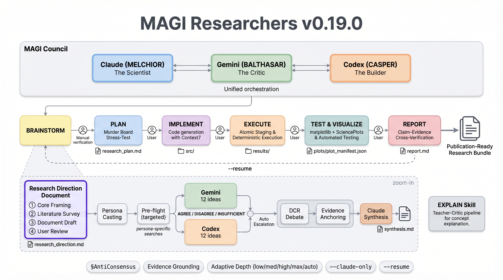

<p align="center">
  
</p>

<h1 align="center">MAGI Researchers</h1>

<p align="center">
  <strong>Three AI models. One synthesis. Zero lost progress.</strong><br/>
  <em>Multi-model research pipeline for Claude Code — Claude, Gemini, and Codex debate, cross-verify, and synthesize publication-ready artifacts.</em>
</p>

<p align="center">
  <a href="https://github.com/Axect/magi-researchers/stargazers"></a>&nbsp;
  <a href="https://github.com/Axect/magi-researchers/tags"></a>&nbsp;
  &nbsp;
  &nbsp;
  &nbsp;
  <a href="https://github.com/Axect/magi-researchers/issues"></a>
</p>

<p align="center">
  <a href="#why-magi">Why MAGI?</a> &bull;
  <a href="#get-started">Get Started</a> &bull;
  <a href="#features">Features</a> &bull;
  <a href="#usage">Usage</a> &bull;
  <a href="#roadmap">Roadmap</a> &bull;
  <a href="CHANGELOG.md">Changelog</a>
</p>

---

> *Like the MAGI system in Evangelion — three supercomputers cross-verifying each other — this plugin orchestrates Claude, Gemini, and Codex for rigorous, multi-perspective research.*

## Why MAGI?

Single-model research has blind spots. One model hallucinates a citation or misses a critical constraint — and nobody catches it.

| | **Single Model** | **MAGI (3 Models)** |
|:---|:---|:---|
| **Brainstorming** | One perspective | Three independent perspectives |
| **Verification** | Self-review (unreliable) | Cross-model peer review |
| **Blind spots** | Undetected | Caught by competing models |
| **Output** | Raw text | Structured report with consensus & divergence analysis |

- **Claude** — *The Scientist.* Synthesis, planning, implementation, report generation.
- **Gemini** — *The Critic.* Creative brainstorming, cross-verification, broad knowledge.
- **Codex** — *The Builder.* Feasibility analysis, code review, implementation focus.

### Case Study: Damped Oscillator Equation Discovery

We gave all three single models and MAGI the same physics problem: *discover an unknown damping function from noisy sensor data*. No single model proposed combining classical diagnostics with modern ML — only MAGI's cross-verification caught that gap.

| Source | Score | Highlight |
|:-------|------:|:----------|
| **MAGI** | **90** | Staged pipeline: rapid diagnostics → symbolic discovery → validation → fallback |
| Claude | 84 | Best code coverage — runnable snippets for every approach |
| Codex | 80 | Elegant physics-informed neural ODE constraints |
| Gemini | 67 | Most accessible for general audience |

<details>
<summary><strong>Experiment details</strong></summary>

- **Task:** Discover $f(\dot{x})$ in $m\ddot{x} + f(\dot{x}) + kx = 0$ from noisy displacement data
- **Setup:** Identical prompt → 4 sources → anonymized blind evaluation via MAGI
- **Evaluation:** Two MAGI evaluator personas scored, cross-reviewed, and debated before synthesis
- **Limitations:** N=1 case study, self-evaluation (MAGI evaluated MAGI), ~7:1 compute ratio
- **Full report:** [`examples/damped_oscillator_comparison/evaluation_report.md`](examples/damped_oscillator_comparison/evaluation_report.md)
- **Raw outputs:** [`examples/damped_oscillator_comparison/`](examples/damped_oscillator_comparison/)

</details>

## Get Started

**Prerequisites:** [Claude Code](https://docs.anthropic.com/en/docs/claude-code) + Python 3.11+ with [uv](https://docs.astral.sh/uv/) + [Gemini CLI](https://github.com/google-gemini/gemini-cli) + [Codex CLI](https://github.com/openai/codex)

**1. Install the plugin** (inside Claude Code):
```
/plugin marketplace add Axect/magi-researchers
/plugin install magi-researchers@magi-researchers-marketplace
```

**2. Set up MCP servers** (one-time):
```bash
claude mcp add -s user gemini-cli -- npx -y gemini-mcp-tool
claude mcp add -s user codex-cli -- npx -y @cexll/codex-mcp-server
claude mcp add -s user context7 -- npx -y @upstash/context7-mcp@latest
```

**3. Run your first research:**
```
/magi-researchers:research "your research topic" --domain physics
```

MAGI generates cross-verified hypotheses, writes implementation code, renders publication-quality plots, and synthesizes a structured report — all saved to `outputs/{topic}/`.

<details>
<summary><strong>Alternative: Local Development</strong></summary>

```bash
git clone https://github.com/Axect/magi-researchers.git
claude --plugin-dir /path/to/magi-researchers
uv add matplotlib SciencePlots numpy
```
</details>

## Features

### Research Pipeline

| Phase | What Happens | Output |
|:---|:---|:---|
| **Brainstorm** | Three models generate and cross-review ideas with expert personas | `brainstorm/` |
| **Plan** | Concrete research plan with execution metadata, stress-tested by a hostile reviewer | `plan/` |
| **Implement** | Language-agnostic implementation with dry-run verification and frontmatter update | `src/` |
| **Execute** | Deterministic code execution from plan frontmatter; generates result artifacts | `results/` |
| **Test & Visualize** | Workspace-aware two-tier testing + publication-quality plots | `tests/` + `plots/` |
| **Report** | Structured report with cross-verified claim-evidence integrity | `report.md` |

### Highlights

- **MAGI-in-MAGI** — `--depth max` scales to N domain specialists, each running a full mini-MAGI brainstorm in parallel with adversarial meta-debate
- **Adversarial review** — Models debate, cross-verify, and attack each other's plans (murder board) before synthesis
- **Resume anywhere** — `--resume` picks up from existing artifacts. No state files — your outputs *are* the checkpoints.
- **Publication-quality output** — `matplotlib` + `scienceplots` (Nature theme), LaTeX math, PNG 300 dpi + vector PDF, structured reports with MAGI traceability

<details>
<summary><strong>All features</strong></summary>

**Quality Assurance**

- **Holistic & weighted scoring** — Default expert-judgment ranking; optionally supply explicit JSON weights or `adaptive` prompt-analyzed weights
- **Dynamic persona casting** — Each model gets a topic-specific expert identity, sharpening ideation
- **Phase gates** — Automated quality checkpoints with conditional MAGI mini-review before each user approval step

**Resilience**

- **Artifact contracts** — Each phase validates upstream files before running. Catches silent failures before they cascade.
- **Agent substitution** — `--substitute "Gemini -> Opus"` replaces a rate-limited model with Claude across all pipeline stages.
- **Workspace anchor** — `.workspace.json` locks the output directory path, preventing artifact drift after context compression.
- **Gemini fallback chain** — Resilient 3-tier model fallback: `gemini-3.1-pro-preview` → `gemini-2.5-pro` → Claude

**More**

- **MAGI traceability review** — All three models cross-verify the final report for orphaned claims and figures
- **Report gap detection** — Auto-generates missing visualizations from existing data
- **Domain templates** — Built-in context for Physics, AI/ML, Statistics, Mathematics, and Paper Writing
- **Journal strategy** — Venue recommendations for [Physics](docs/journal-strategies.md#particle-physics-phenomenology), [AI/ML](docs/journal-strategies.md#aiml-conferences--journals), and [Interdisciplinary](docs/journal-strategies.md#interdisciplinary-science-ml--natural-sciences) research

</details>

<details>
<summary><strong>Under the hood</strong></summary>

- **Plot manifest** — Structured `plot_manifest.json` with metadata, section hints, and captions for automated report integration
- **Common Restrictions** — Phase 4 enforces four output-interface contracts: `plot_manifest.json` (fixed schema), PNG + PDF/SVG dual format, execution evidence, dependency spec file. Internal process is autonomous.
- **Workspace Detection** — Phase 3 and 4 detect languages and ecosystems from actual `src/` files (package managers first, then file extensions). Priority: reality (`src/`) > plan intent > domain defaults.
- **Two-tier testing** — Tier 1 (unit, mock-based, always runs) and Tier 2 (integration, depends on `results/`, skipped gracefully if absent). Test frameworks match the detected workspace language.
- **Deterministic execution** — Phase 3.5 reads `execution_cmd` and `dry_run_cmd` directly from `research_plan.md` YAML frontmatter. No heuristics, no entry-point guessing.
- **`research_plan.md` frontmatter** — Carries `languages`, `ecosystem`, `execution_cmd`, `dry_run_cmd`, `expected_outputs`, and `estimated_runtime` fields as machine-readable metadata for downstream phases.
- **Cross-phase artifact contracts** — Each phase validates incoming artifacts before running (tool-based Glob/Read, not LLM guesswork)
- **Depth-controlled token budget** — `--depth low` skips cross-review for fast/cheap runs; `--depth high` enables full adversarial debate
- **`@filepath` artifact references** — MCP tool calls use `@filepath` syntax instead of inline content, so large artifacts are read directly from disk with zero truncation

</details>

## Usage

| Command | Description |
|:---|:---|
| `/magi-researchers:research "topic"` | Full pipeline (Brainstorm → Plan → Implement → Execute → Test → Report) |
| `/magi-researchers:research-brainstorm "topic"` | Brainstorming with cross-verification |
| `/magi-researchers:research-write --source <dir>` | Collaborative writing from research artifacts |
| `/magi-researchers:research-explain "concept"` | Concept explanation with Teacher/Critic pipeline |
| `/magi-researchers:research-implement` | Language-agnostic implementation (needs existing plan) |
| `/magi-researchers:research-execute` | Execute research code; generate `results/` artifacts |
| `/magi-researchers:research-test` | Workspace-aware testing & visualization |
| `/magi-researchers:research-report` | Report generation |

### Depth Control

The `--depth` flag controls how thoroughly models review each other's work:

| Depth | What Happens | Cost |
|:---|:---|:---|
| `low` | Independent brainstorming, no cross-review | Cheapest |
| `medium` (default) | Cross-model peer review + synthesis | Standard |
| `high` | Full adversarial debate (defend/concede/revise) | Higher |
| `max` | MAGI-in-MAGI: N specialist subagents, each running a full mini-MAGI | Highest |

<details>
<summary><strong>All flags</strong></summary>

| Flag | Values | Default | Description |
|:---|:---|:---|:---|
| `--domain` | `physics` `ai_ml` `statistics` `mathematics` `paper` | auto-inferred | Research domain for context |
| `--weights` | JSON / `adaptive` | holistic | Scoring mode: omit for expert-judgment ranking, JSON for weighted, `adaptive` for prompt-analyzed |
| `--depth` | `low` `medium` `high` `max` | `medium` | Review thoroughness |
| `--personas` | `2`–`5` | `auto` | Number of domain-specialist subagents for `--depth max` |
| `--resume` | `<output_dir>` | — | Resume an interrupted pipeline from the last completed phase |
| `--claude-only` | flag | off | Replace Gemini/Codex with Claude subagents for single-model usage |
| `--substitute` | `"Gemini -> Opus"` `"Codex -> Opus"` | — | Replace a specific model with Claude when hitting rate limits |

</details>

```bash
# Quick brainstorm with default settings
/magi-researchers:research "neural ODE solvers for stiff systems" --domain physics

# Deep analysis with adversarial debate
/magi-researchers:research "causal inference in observational studies" --domain statistics --depth high

# Resume a crashed session — MAGI picks up where you left off
/magi-researchers:research "neural ODE solvers" --resume outputs/neural_ode_solvers_20260225_v1

# Hierarchical multi-persona analysis (MAGI-in-MAGI)
/magi-researchers:research "variational inference for Bayesian deep learning" --domain ai_ml --depth max --personas 4

# Substitute Gemini with Claude when hitting rate limits
/magi-researchers:research "neural ODE solvers" --domain physics --substitute "Gemini -> Opus"

# Fast ideation only (no cross-review, lowest cost)
/magi-researchers:research-brainstorm "transformer alternatives for long sequences" --domain ai_ml --depth low
```

> If MAGI saves you research time, consider leaving a [star](https://github.com/Axect/magi-researchers/stargazers) so other researchers can find it.

### Output Structure

```
outputs/{topic_YYYYMMDD_vN}/
├── .workspace.json   # Workspace anchor (absolute path for artifact safety)
├── brainstorm/       # Personas, ideas, cross-reviews, debate, synthesis
├── explain/          # Teacher/Critic analysis, strategy, final explanation
├── write/            # Intake, outline, draft, review, final document
├── plan/             # Research plan (with YAML frontmatter), murder board, mitigations, phase gate
├── src/              # Implementation (any language) + phase gate
├── results/          # Generated artifacts from Phase 3.5 (data, checkpoints, logs)
├── tests/            # Test suite (Tier 1 unit + Tier 2 integration) + phase gate
├── plots/            # PNG + PDF + plot_manifest.json
└── report.md         # Final structured report
```

Each phase produces artifacts that double as resume checkpoints — just pass `--resume` to continue from where you left off.

<details>
<summary><strong>Full artifact tree</strong></summary>

```
.workspace.json               # Workspace anchor (absolute output path)
brainstorm/
├── weights.json              # Scoring weights
├── personas.md               # Expert personas
├── gemini_ideas.md           # Gemini brainstorm
├── codex_ideas.md            # Codex brainstorm
├── gemini_review_of_codex.md # Cross-review (depth ≥ medium)
├── codex_review_of_gemini.md # Cross-review (depth ≥ medium)
├── disagreements.md          # Disagreement summary (depth = high)
├── debate_round2_gemini.md   # Adversarial debate (depth = high)
├── debate_round2_codex.md    # Adversarial debate (depth = high)
└── synthesis.md              # Weighted synthesis

plan/
├── research_plan.md          # Research plan (YAML frontmatter: languages, execution_cmd, etc.)
├── murder_board.md           # Plan stress-test
├── mitigations.md            # Flaw mitigations
└── phase_gate.md             # Plan quality gate

src/
├── *                         # Research implementation (any language)
└── phase_gate.md             # Implementation quality gate

results/
├── run_log.txt               # Full execution log
├── pre_execution_status.json  # Structured status (state, error_class, severity, retryable, next_action)
└── *                         # Generated artifacts (csv, npz, pt, etc.)

tests/
├── test_*                    # Tier 1 unit tests (mock-based)
├── test_integration_*        # Tier 2 integration tests (guarded by results/)
└── phase_gate.md             # Test quality gate
```

</details>

<details>
<summary><strong>Full artifact tree — <code>--depth max</code></strong></summary>

```
.workspace.json               # Workspace anchor (absolute output path)
brainstorm/
├── weights.json              # Scoring weights
├── personas.md               # N domain-specialist personas
├── persona_1/                # Persona 1 mini-MAGI output
│   ├── gemini_ideas.md
│   ├── codex_ideas.md
│   ├── gemini_review_of_codex.md
│   ├── codex_review_of_gemini.md
│   └── conclusion.md
├── persona_2/
│   └── ...                   # (same 5 files per persona)
├── persona_N/
│   └── ...
├── meta_review_gemini.md     # Gemini meta-review of all conclusions
├── meta_review_codex.md      # Codex meta-review of all conclusions
├── meta_disagreements.md     # Meta-disagreement summary
├── meta_debate_gemini.md     # Adversarial debate — Gemini
├── meta_debate_codex.md      # Adversarial debate — Codex
└── synthesis.md              # Enriched final synthesis
```

</details>

<details>
<summary><strong>Recommended Permissions</strong></summary>

Add to `.claude/settings.local.json`:

```json
{
  "permissions": {
    "allow": [
      "Bash(uv:*)",
      "Bash(uv run:*)",
      "Bash(uv run python3:*)",
      "Bash(uv add:*)",
      "Bash(uv sync:*)",
      "Bash(mkdir:*)",
      "mcp__gemini-cli__ask-gemini",
      "mcp__gemini-cli__brainstorm",
      "mcp__codex-cli__ask-codex",
      "mcp__codex-cli__brainstorm",
      "mcp__plugin_context7_context7__resolve-library-id",
      "mcp__plugin_context7_context7__query-docs"
    ]
  }
}
```

</details>

## Roadmap

**Latest — v0.10.0:** Holistic scoring (expert-judgment ranking as default), agent substitution (`--substitute`), workspace anchor, token-optimized skills. See [CHANGELOG.md](CHANGELOG.md) for full history.

**Up next:**
- [ ] Terminal demo GIF — one-command walkthrough
- [ ] More domain & journal strategy templates
- [ ] Ubiquitous Context7 — live doc lookups during testing and report writing
- [ ] Conditional variance enforcement — smart error-bar policy
- [ ] Cost estimation — token budget preview before execution

## Contributing

Contributions welcome — especially new domain templates. See [CONTRIBUTING.md](CONTRIBUTING.md).

## License

[MIT](LICENSE)
